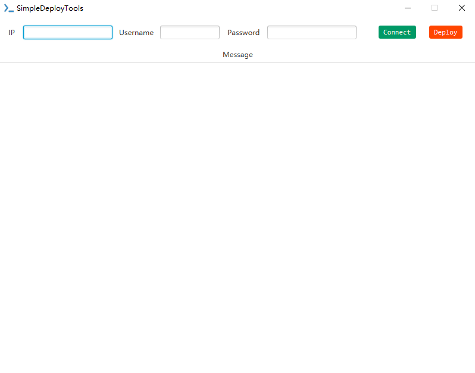
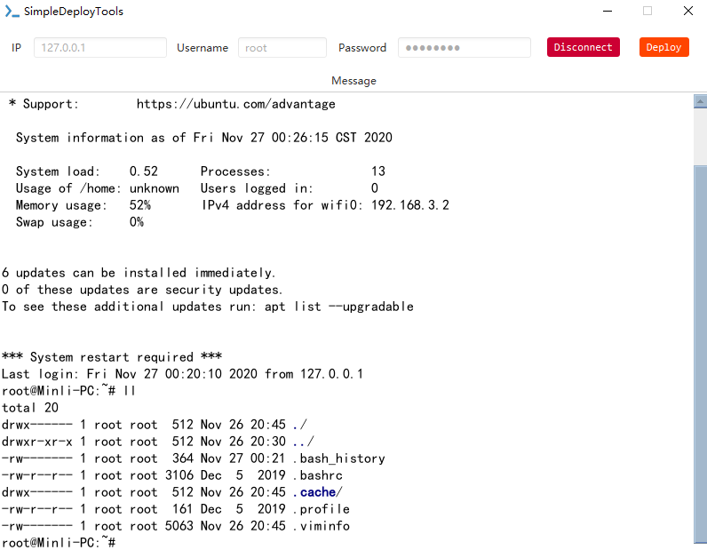

## SimpleDeployTools

[Chinese Document](README.md)

* ### The simple deployment tool based on JavaFX supports Chinese and English, supports command execution through SSH connection server, and supports the function of one key deployment by executing local script

* ### How to use it:

   * Download [Releases](https://github.com/min-li/SimpleDeployTools/releases)
    
   * Windows:

     * Download exe file install

   * Mac/Linux:

     * Download jar, execution java -jar SimpleDeployTools-1.0.jar

* ### Note:

    1. The default port is 22. If you need to use another port, enter IP:port in the IP input box
    
    2. After clicking the deployment button, the local file selection box will pop up, which supports the selection of shell script files for execution

* ### Screenshot:

    

    
