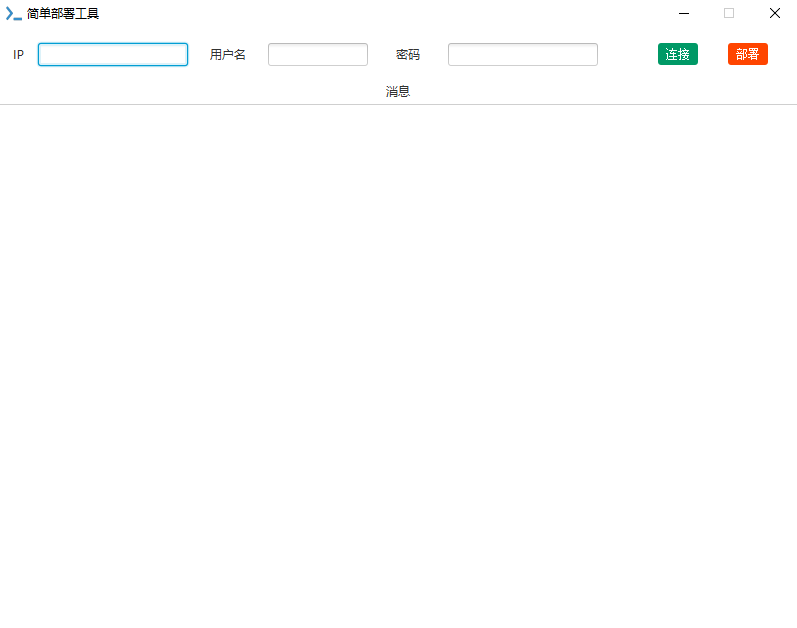
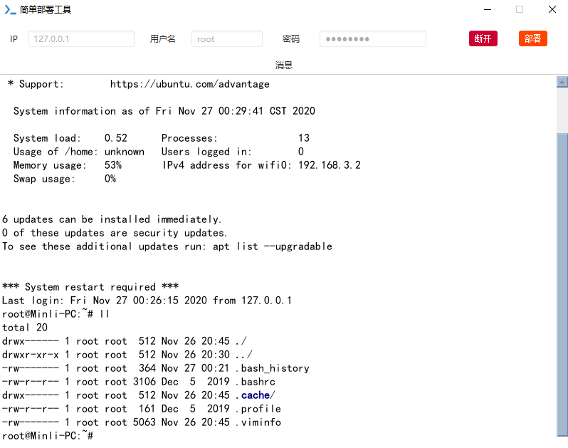

## 简单部署工具

[English Document](README.md)

* ### 基于JavaFx的简单部署工具，支持中文和英文，支持通过SSH连接服务器执行命令，同时支持执行本地脚本实现一键部署的功能

* ### 如何使用:

   * 下载 [Releases](https://github.com/min-li/SimpleDeployTools/releases)
    
   * Windows:

     * 直接下载exe文件安装

   * Mac/Linux:

     * 下载jar，执行java -jar SimpleDeployTools-1.0.jar

* ### 注意事项:

    1. 默认端口22，如果需要使用其它端口，IP输入框输入IP:端口
    
    2. 点击部署按钮后会弹出本地文件选择框，支持选择Shell脚本文件执行

* ### 主要依赖

    1. [jediterm](https://github.com/JetBrains/jediterm)
    
    2. [jsch](http://www.jcraft.com/jsch/)

* ### 截图:

    

    
